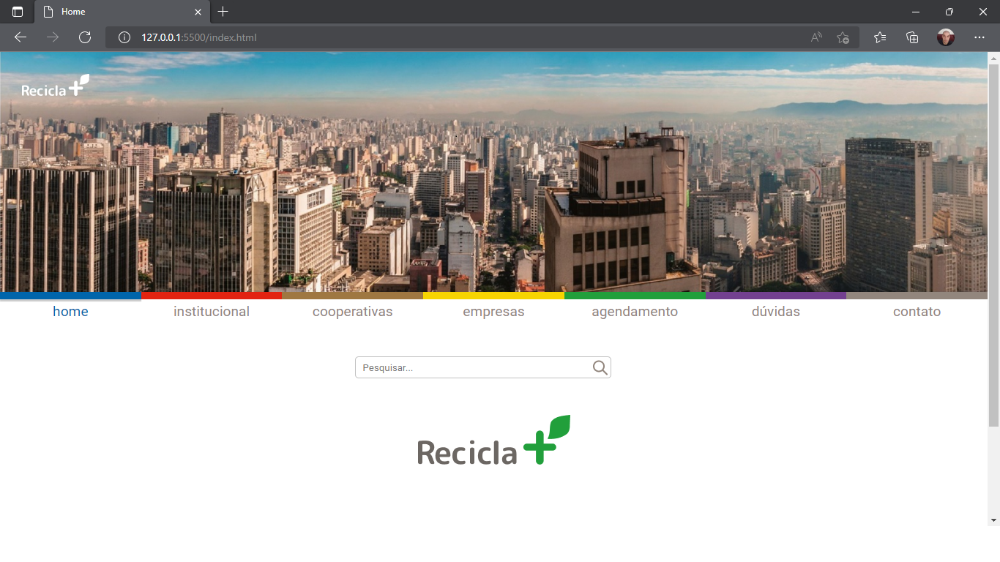

# Portal Recicla+

O Portal Recicla+ é um site que tem a idéia de resolver os problemas de descarte incorreto de
resíduos pelas empresas da cidade de São Paulo, que geram uma quantidade considerável de
lixo retornável e possuem dificuldades em relação ao descarte destes materiais. Através do
portal, nossa missão é disponibilizar para qualquer empresa a oportunidade de solucionar os
problemas com o descarte de uma forma prática, eficiente, econômica e rápida. Do outro lado 
temos as Cooperativas que também poderão se cadastrarem e terem acesso ao sistema, podendo 
terem agendamentos em seu nome para efetuarem a busca programada dos materiais na empresa 
requerente, facilitando e agilizando seu trabalho.

## Demonstração de uso

 Tela Home do Site 

### Telas da empresa Requerente

Cadastro

Autenticação/login

Dashboard

Gerar novo agendamento primeira parte

Gerar novo agendamento segunda parte

Meus agendamentos gerados

Mais informações e excluir agendamento 

Atualização de dados pessoais

### Telas da Cooperativa

Cadastro

Autenticação/login

Dashboard

Meus agendamentos gerados

Mais informações e atualizar agendamento 

Atualização de dados pessoais

## Integrantes 

- [ALINE NASCIMENTO VIEIRA](https://www.github.com/AlineNVieira)
- [ANDRÉ LUIZ MARINHO DE SOUZA](https://www.github.com/AndreSouzaTI)
- [BIANCA SILVEIRA DA CUNHA](https://www.github.com/cunhasbia)
- [DAVID LAURENTINO DA CONCEIÇÃO](https://www.github.com)
- [JOSUÉ LAURENTINO DA CONCEIÇÃO](https://www.github.com/JosueLauren)
- [MIKAEL BRAGA DA SILVA](https://www.github.com/)
- [MIREILLE CRISTINA DE PONTES FONSECA NUNES](https://www.github.com/MireilleCristina)
- [THIAGO LAURENTINO DA CONCEIÇÃO](https://www.github.com/tiagolauren)

    GRUPO 6

